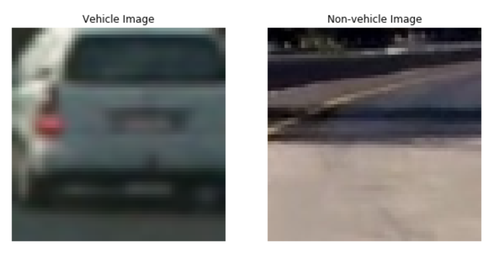
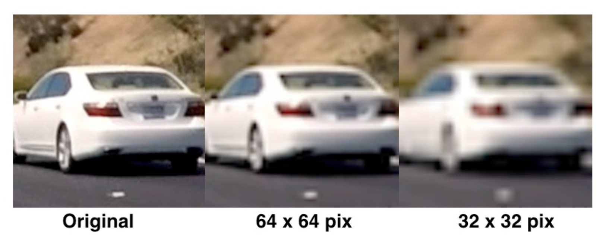
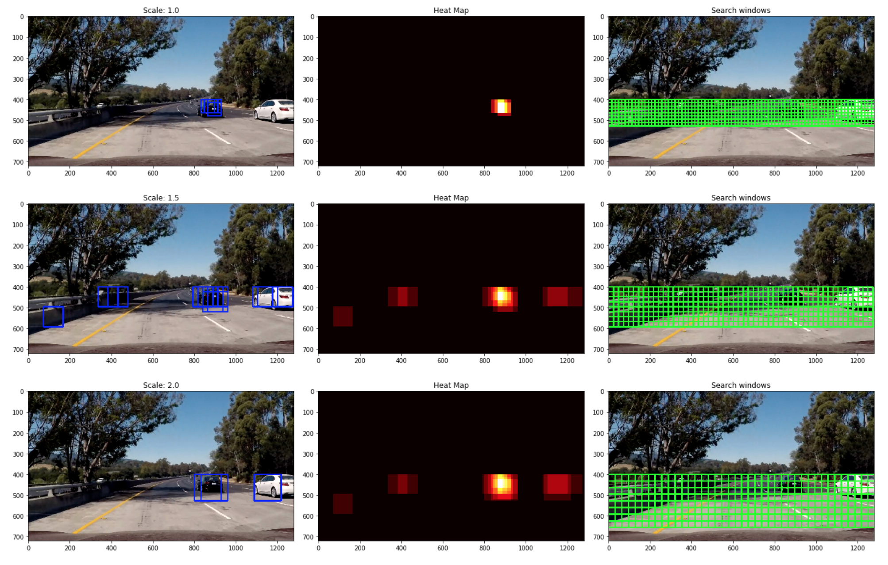
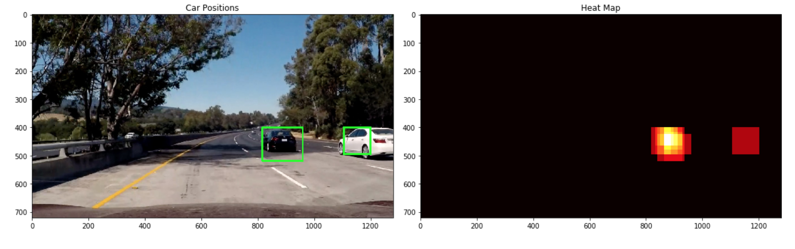

# Vehicle Detection and Tracking

## 1. Project Overview

### 1.1 Goal 

The goal of the project is to create a pipeline to detect and track vehicles in a video. A demo of the pipeline can be found on [GoogleDrive](https://drive.google.com/drive/folders/1FtSDQqfM-zir0bwEGAteVRfMtiHTx1fT?usp=sharing)

[(https://drive.google.com/drive/folders/1FtSDQqfM-zir0bwEGAteVRfMtiHTx1fT?usp=sharing)

### 1.2 Project structure

* **rawdata_exploration.ipynb**: Jupyter notebook that performs an initial round of the data set exploratory visualisation and summarisation. Furthermore, this notebook also splits the dataset into the training and test set while taking into account the *time series issues* (i.e. multiple consecutive frames)  
* **build_classifier.ipynb**: Jupyter notebook that performs feature extraction, feature normalisation and trains a Linear SVC to classify vehicles in an image
* **detection_and_tracking.ipynb**: Notebook that creates a pipeline to detect & track vehicles in a video
* **readme_images/**: Folder to store images used within this README.md
* **test_images/**: Folder containing a set of images for test purposes
* **rawdata.p**: Pickle file containing the processed raw data set of image paths
* **classifier_data.p**: Pickle file containing the trained Linear SVC and parameters associated with feature extraction
* **project_video.mp4**: Video over which to test the pipeline
* **project_video_output.mp4**: Resulting output on passing the *project_video* through the pipeline

## 2. Pipeline

The various steps invovled in the pipeline are as follows, each of these has also been discussed in more detail in the sub sections below:

* Perform feature extraction on a labeled training set of images and train a **Linear SVM classifier**. The feature vector consists of: 
  * **Histogram of Oriented Gradients (HOG)** 
  * Spatially binned raw color values, and,
  * Histogram of color values
* Implement a sliding-window technique and use the trained classifier to search for vehicles in images
* Create a heat map of recurring detections frame by frame to reject outliers, handle multiple detections and follow detected vehicles
* Estimate a bounding box for vehicles detected


### 2.1 Dataset exploratory visualisation and summarisation

The labelled dataset used for this project can be downloaded here:
* [vehicle](https://s3.amazonaws.com/udacity-sdc/Vehicle_Tracking/vehicles.zip), and, 
* [non-vehicle](https://s3.amazonaws.com/udacity-sdc/Vehicle_Tracking/non-vehicles.zip)

These example images come from a combination of the [GTI vehicle image database](http://www.gti.ssr.upm.es/data/Vehicle_database.html), the [KITTI vision benchmark suite](http://www.cvlibs.net/datasets/kitti/), and examples extracted from the project video itself.

The exploration of the data set revealed the following:

* Total # vehicle images: 8792
* Total # non-vehicle images: 8957
* Image shape: (64, 64, 3)
* Image dtype: float32

An example from each of the classes has been visualised below for the reader.



From above we can conclude that the dataset is fairly balanced as it contains equal proportions of vehicle and non-vehicle images. However, the most important observation was that the dataset contained sequences of images where the target object (vehicles in this case) appears almost identical in a whole series of images. In such a case, performing a randomized train-test split will be subject to overfitting because images in the training set may be nearly identical to images in the test set.

### 2.2 Feature Extraction

In order to be able to successfully classify vehicles in an image, a set of useful features were needed over which a classifier could be trained. For this project, the following features were used:

1. **Spatially binned raw color values**: It is known that raw pixel intensity values can be useful in performing classification. However, it can be cumbersome to include three color channels of a full resolution image. Therefore, we perform spatial binning on an image which allows us to retain enough useful information to help find vehicles all the while reducing the number of pixels. <br/> <br />For our purposes, OpenCV's ```cv2.resize()``` API was used to scale down the resolution of an image. An example of this can be visualised below. <br/><br/>


2. **Histogram of color values**: Although the raw color values provide us useful information, to be able to stay robust to changes in object appearance we also included the distribution of color values. This removes our dependence from the object's structure and allows for variations in aspects and orientations to be matched.

3. **Histogram of Oriented Gradients (HOG)**: In addition to the color information, knowledge of the shape of the object was also considered useful in performing classification. As a result, HOG features were appended to the overall feature vector. HOG was chosen due to its robustness to noise over simply including per pixel gradient information. <br/><br/> For this project, scikit-image's ```hog()``` API was used.

### 2.3 Handling multiple detections and false positives

As a next step, a heatmap was generated by combining detections from all the multi-scaled windows. This was then thresholded by criterion to reject false positives. The process of multi-scale window HOG sub-sampling, heatmap generation and thresholding has been visualised below for the reader.




## My future work will be related to lane detection using dl methon speciall R-Mask-CNN and for future work i would like to work  on LIDAR sensors which are very fast and does real time processing. 

* The vehicles dataset used for this project was not very extensive and only consisted of images of sedans. This can be extended to include different types of vehicles (such as trucks, motorcycles, etc) for practical usage.

* The best test set accuracy achieved was 0.9781. Although this sufficed for this project, a much higher accuracy would be needed for practical use. 

* The current pipeline is extremely slow and nowhere close to providing real time processing capabilities. Although the pipeline was sped up by skipping frames and performing a whole image window search only once every 12 frames, it introduced an issue where a new target object can only be detected with a 0.5 sec delay. Hence, providing a trade-off between improved detection ability and processing speed.

* As a result, for future work, I would like to explore the use DL models such YOLO, SSD, etc. to achieve higher accuracy and real time processing ability.

Made By- Aryan Karn 
MNNIT Allahabad

